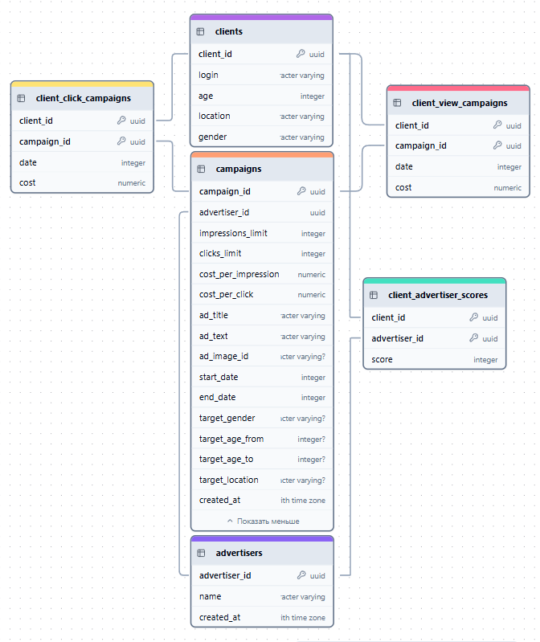

# ZoomAD Platform

Проект для индивидуального тура олимпиады по [промышленной разработке PROD 2024/25](https://prodcontest.ru)

Результат: **Призёр I степени (победитель)**

### Содержание

- [Запуск](#запуск)
  - [Строение docker-compose.yml](#строение-docker-composeyml)
  - [Инструкция по запуску](#инструкция-по-запуску)
- [Документация API](#документация-api)
- [Тестирование](#тестирование)
- [Визуализация статистики](#визуализация-статистики)
  - [Демонстрация статистики](#демонстрация-статистики)
- [Бот Telegram](#бот-telegram)
  - [Демонстрация работы](#демонстрация-работы)
- [Технические решения](#технические-решения)
  - [PostgreSQL (База данных)](#postgresql-база-данных)
  - [MinIO (AWS S3)](#minio-aws-s3)
  - [Redis (in-memory storage)](#redis-in-memory-storage)
  - [Grafana (визуализация статистики)](#grafana-визуализация-статистики)
  - [Prometheus (сбор статистики)](#prometheus-сбор-статистики)
  - [OpenAI (ИИ)](#openai-ии)
- [Логика работы основных компонентов](#логика-работы-основных-компонентов)
  - [Client / Advertiser Upsert](#client--advertiser-upsert)
  - [Рекламные кампании](#рекламные-кампании)
    - [Создание](#создание)
    - [Остальные процессы кампании](#остальные-процессы-кампании)
  - [Статистика](#статистика)
  - [Рекламный алгоритм](#рекламный-алгоритм)
- [Схема БД](#схема-бд)
  - [Advertiser](#advertiser)
  - [Client](#client)
  - [Campaign](#campaign)
  - [Client ML Score](#client-ml-score)
  - [Client View](#client-view)
  - [Client Click](#client-click)

## Запуск

### Строение docker-compose.yml

1. backend

   - Главный сервис проекта, отвечает за работу бэкенда и API
   - Использует образ *python3.12:alpine*, alpine версия выбрана для оптимизации веса конечного образа
   - Оснащён механизмом healthcheck для бесперебойной работы сервиса
   - Зависит от сервисов redis (необходим для хранения информации о дне), minio и db
   - Заданы все необходимые для работы переменные среды
   - Во внешнюю сеть открыт порт 8080

2. bot

   - Сервис, отвечающий за функционирование телеграм бота и используется исключительно как обёртка над API
   - Использует образ *python3.12:alpine*, alpine версия выбрана для оптимизации веса конечного образа
   - Заданы все необходимые для работы переменные среды
   - Зависит от сервисов redis (для хранения состояния пользователей), backend

3. db

   - Сервис, отвечающий за работу базы данных
   - Использует образ *postgres:alpine*
   - Для предотвращения переполнения максимального количества сессий передан параметр `max-connections=1000`
   - Заданы переменные среды, задающие параметры для авторизации в БД
   - Оснащён механизмом healthcheck для бесперебойной работы сервиса
   - Внутрь сети контейнеров выделен порт 5432
   - Выделено хранилище pgdata для сохранения данных из БД после перезапуска

4. redis

   - Сервис, отвечающий за работу redis
   - Использует образ *redis:alpine*
   - Внутрь сети контейнеров выделен порт 6379
   - Выделено хранилище redis_data для сохранения всех состояний после перезапуска

5. minio

   - Сервис, отвечающий за работу S3 объектного хранилища
   - Использует образ *minio/minio*
   - Заданы переменные среды, задающие параметры для авторизации в сервисе
   - Оснащён механизмом healthcheck для бесперебойной работы сервиса
   - Внутрь сети контейнеров выделен порт 9000
   - Выделено хранилище minio_data для сохранения данных из БД после перезапуска

6. prometheus

   - Сервис, отвечающий за сбор данных о нагрузке с сервиса backend
   - Использует образ *prom/prometheus:latest*
   - Внутрь сети контейнеров выделен порт 9090
   - Зависит от сервиса backend
   - Параметры конфигурации сервиса передаются из `prometheus/prometheus.yml`

7. grafana

   - Сервис, отвечающий за визуализацию всех статистики
   - Использует образ *grafana/grafana*
   - Во внешнюю сеть открыт порт 3000
   - Зависит от сервисов prometheus и db (часть статистики идёт из БД)
   - Параметры конфигурации сервиса передаются из `grafana/dashboard.yml`, `grafana/datasource.yml` и `grafana/dashboards/*`
   - Выделено хранилище grafana_data для сохранения всех настроек после перезапуска

### Инструкция по запуску

1. Склонируйте данный репозиторий
2. Убедитесь, что на вашем устройстве установлен `docker` и `docker compose`
3. Откройте терминал и выполните команду `docker compose up -d --build` и дождитесь завершения процесса запуска
4. Приложение успешно запущено!

## Документация API

Для получения информации о нашем API перейдите по пути [http://127.0.0.1:8080/docs](http://127.0.0.1:8080/docs).

На данной странице предоставлена подробная Swagger документация.

## Тестирование

1. Перейдите в директорию `backend`.
2. Убедитесь, что на вашем устройстве установлены Python (версии 3.12 или выше), PIP и Docker.
3. Откройте терминал и последовательно выполните команды:

   ```shell
   pip install poetry
   poetry install
   poetry shell
   ```

4. Не выходя из окна терминала, выполните команду `pytest`.

Среднее время, необходимое на прогон тестов — 40 секунд.

## Визуализация статистики

Мы предоставляем вам возможность посмотреть на красивую статистику с подробными графиками с помощью сервиса **Grafana**, для этого:

1. Перейдите по пути [http://127.0.0.1:3000](http://127.0.0.1:3000).
2. Войдите под именем пользователя `prod` и паролем `prod`.
3. Перейдите во вкладку _Dashboards_.
4. Для общей статистики по «ZoomAD Platform», выберите _Statistic Dashboard_; для статистики по конкретному рекламодателю — _Advertiser Dashboard_; для информации по загруженности платформы — _Backend Dasboard_.

Примечание: для _Advertiser Dashboard_ сверху можно будет выбрать значения `Advertiser (рекламодатель)` и `Campaign (рекламная кампания)`, по заданным параметрам и будет составляться статистика.

### Демонстрация статистики

Пример того, как выглядит статистика, можно найти [в этом видео](https://rutube.ru/video/private/b9b45df64f3024dd3ba21bcf7b314b8c/?p=dYtpKu9AKLb0gbvTxwkdkg). Примечание: предоставлен не последний вариант, в последней версии появились дополнительные визуализации.

## Бот Telegram

Функционал рекламодателя доступен в нашем [Telegram-боте](https://t.me/zoomprod_bot)! Просто переходите [по ссылке](https://t.me/zoomprod_bot) и следуйте инструкциям.

Возможности: создание и изменение рекламодателей и их рекламных кампаний; просмотр статистики.

Дополнительная функция — удобный предпросмотр рекламы, который позволяет оценить то, как будущие пользователи будут видеть рекламу.

### Демонстрация работы

После старта бота нас приветствует начальное меню, с помощью которого мы можем найти или создавать рекламодателя, зарегистрировать клиента, посмотреть рекламу или сменить день:


Давайте попробуем создать нового рекламодателя:


Нас встречает меню рекламодателя, давайте создадим новую рекламную кампанию для конкурса грантов (тут же можно
увидеть пример генерации рекламного текста при помощи ИИ):


Теперь мы можем редактировать рекламную кампанию:


Так выглядит меню редактирования после запуска кампании (после её окончания возможности вызвать это меню нет):


Если включён режим модерации (см. документацию API `/security/moderation`), то как при создании, так
и при изменении у вас не получится написать неэтичный текст рекламной кампании:


Теперь давайте вернёмся назад и попробуем перейти к уже существующей рекламной кампании:


Сейчас тут только 1 кампания, что и не удивительно, однако при большем их количестве будет возможность перемещаться по страницам при помощи кнопок (на данный момент они недоступны). Давайте создадим ещё пару кампаний.


Управление статистикой эквивалентно как для рекламодателя, так и для рекламной кампании, поэтому посмотрим на пример статистики рекламодателя (предварительно я посмотрел несколько реклам).


Предлагаю снова вернуться назад и вместо создания рекламодателя, попробуем выбрать уже существующего, в целом этот процесс схож с выбором рекламной кампании:


Из самого интересного остался лишь просмотр рекламы, позволяющий продемонстрировать наш алгоритм её подбора,
в процессе просмотра вы будете смотреть от имени случайного существующего клиента.


А всё остальное вы можете попробовать уже сами в нашем боте по ссылке https://t.me/zoomprod_bot!

## Технические решения

### PostgreSQL (База данных)

**PostgreSQL** была выбрана в качестве нашей базы данных так как на данный момент за счёт скорости своей работы
и функционала она является одной из самых лучших СУБД на рынке. PostgreSQL применяется в таких кампаниях
как Apple, Microsoft, Google и другие.

### MinIO (AWS S3)

**MinIO** используется в качестве объектного хранилища по стандартам AWS S3, она легко поднимается локально
и позволяет быстро и без лишних проблем хранить изображения рекламных кампаний. MinIO применяет
компания, создавшая популярный linux дистрибутив Ubuntu - Canonical Group.

### Redis (in-memory storage)

**Redis** позволяет быстро работать с состояниями пользователей в телеграм-боте за счёт их хранения прямо
в оперативной памяти, но при этом возможностью сохранять эти данные при перезагрузке. Redis активно
используется такими гигантами как Twitter, Amazon, OpenAI и другие.

### Grafana (визуализация статистики)

**Grafana** — один из лучших вариантов визуализации любой статистики, при этом обеспечивая быструю работу,
приятное оформление и гибкость, а также простоту настройки. В том числе Grafana поддерживает широкий спектр
источников данных, таких как например PostgreSQL, используемый в проекте. Grafana используется Sony, eBay,
Salesforce и другими компаниями.

### Prometheus (сбор статистики)

**Prometheus** используется для сбора технической статистики с backend части нашей платформы, обеспечивая
постоянное получение актуальной информации о загруженности в реальном времени. Prometheus является одним из
наиболее используемых TSDB _(Time Series Data Base)_, его применяет например PayPal, DigitalOcean и Docker.

### OpenAI (ИИ)

OpenAI является лидером на рынке услуг Искусственного Интеллекта, при этом предоставляя достаточно дешёвые услуги. Мы используем их модели для генерации и модерации текстов рекламных кампаний. Их продукцию используется повсеместно многими компаниями, на основе их моделей работает поисковик Bing, Github Copilot, Duolingo и другие продукты.

## Логика работы основных компонентов

### Client / Advertiser Upsert

`/clients/bulk`, `/advertisers/bulk`

Для реализации данной функции используется конструкция ON CONFLICT, используемая в нашей СУБД PostgreSQL
А сам запрос проходит односторонний путь от вызова API до PostgreSQL, поскольку все выходные данные уже
предоставлены пользователем и информация из БД не нужна. Путь запроса можно увидеть на этой блок-схеме:


### Рекламные кампании

#### Создание

`/advertisers/:advertiser_id/campaigns`

Процесс создания рекламной кампании уже более сложен и состоит из нескольких сервисов, поскольку необходимо
получение текущего дня и состояния активации модерации из Redis, модерация с помощью GPT,
информации о существующих файлах из S3, ну и конечно информация из PostgreSQL, всё можно увидеть на блок-схеме:


На схеме можно заметить первоначальный запрос к AdvertiserService с обратной красной стрелкой, это необходимо
для проверки того, что рекламодатель, от имени которого мы хотим создать кампанию вообще существует.

#### Остальные процессы кампании

Для остальных процессов блок-схема в общем виде остаётся почти такой же, поэтому не вижу смысла её дублировать,
разве что в случае что с получением и удалением кампаний она сильно упрощается:


### Статистика

`/stats/`

Отдельно стоит описать статистику, поскольку она взаимодействует со многими сущностями базы данных.
Мы достаём все данные из БД, агрегируя по дням если это необходимо. Пример запроса по получению статистики
можно увидеть на блок-схеме:


### Рекламный алгоритм

Рекламный алгоритм подбираем рекламу, сортируя её по убыванию показателя ожидаемой прибыльности рекламы (Expected profit), вычисляемого
по формуле ниже:

```math
\text{Expected profit}_i =
\frac
{\text{predicted score}_i}
{\mathbb{P}(\text{predicted score}, 90)
}
\cdot
\text{price}_\text{click}
+
\text{price}_\text{impression}
```

где $\mathbb{P}(v, p)$ — $p$-перцентиль для переменной $v$.

Данная формула меняется в случае, если объявление уже было показано клиенту таким образом, что оно уже не сможет
выпасть, пока существуют другие непросмотренные объявления.

```math
\text{New expected profit}_i =
\frac
{\text{Expected profit}_i - \text{price}_\text{impression}}
{2 \cdot
\max(
  \text{price}_\text{click}, \space
  \text{price}_\text{impression}
)
}
```

Также при показе объявления учитывается, что оно подпадает под указанные настройки таргетирования, и что по данному
объявлению ещё не был совершён переход, ведь в таком случае мы уже не сможем с него заработать.

Остальную информацию об API эндпоинтах вы можете найти на странице документации http://127.0.0.1:8080/docs.

## Схема БД



### Advertiser

| Поле          | Тип                      | Описание                                  |
| ------------- | ------------------------ | ----------------------------------------- |
| advertiser_id | uuid, primary            | ID рекламодателя                          |
| name          | varchar                  | Имя рекламодателя                         |
| created_at    | timestamp, with timezone | Дата создания (для сортировки, пагинации) |

### Client

| Поле      | Тип           | Описание                  |
| --------- | ------------- | ------------------------- |
| client_id | uuid, primary | ID клиента                |
| login     | varchar       | Логин клиента             |
| age       | integer       | Возраст клиента           |
| location  | varchar       | Локация клиента           |
| gender    | varchar       | Пол клиента (MALE/FEMALE) |

### Campaign

| Поле                | Тип                      | Описание                                  |
| ------------------- | ------------------------ | ----------------------------------------- |
| campaign_id         | uuid, primary            | ID кампании                               |
| advertiser_id       | uuid, fk advertisers     | ID рекламодателя                          |
| impressions_limit   | integer                  | Лимит показов                             |
| clicks_limit        | integer                  | Лимит переходов                           |
| cost_per_impression | numeric                  | Стоимость за показ                        |
| cost_per_click      | numeric                  | Стоимость за переход                      |
| ad_title            | varchar                  | Заголовок рекламы                         |
| ad_text             | varchar                  | Текст рекламы                             |
| ad_image_id         | varchar?                 | ID изображения рекламы                    |
| start_date          | integer                  | Дата начала кампании                      |
| end_date            | integer                  | Дата окончания кампании                   |
| target_gender       | varchar?                 | Целевой пол                               |
| target_age_from     | integer?                 | Минимальный возраст аудитории             |
| target_age_to       | integer?                 | Максимальный возраст аудитории            |
| target_location     | varchar?                 | Целевая локация                           |
| created_at          | timestamp, with timezone | Дата создания (для сортировки, пагинации) |

### Client ML Score

| Поле          | Тип                                           | Описание             |
| ------------- | --------------------------------------------- | -------------------- |
| client_id     | uuid, primary, cascade delete, fk clients     | ID клиента           |
| advertiser_id | uuid, primary, cascade delete, fk advertisers | ID рекламодателя     |
| score         | integer                                       | Оценка релевантности |

### Client View

| Поле        | Тип                                         | Описание         |
| ----------- | ------------------------------------------- | ---------------- |
| client_id   | uuid, primary, cascade delete, fk clients   | ID клиента       |
| campaign_id | uuid, primary, cascade delete, fk campaigns | ID кампании      |
| date        | integer                                     | Дата показа      |
| cost        | numeric                                     | Стоимость показа |

### Client Click

| Поле        | Тип                                         | Описание           |
| ----------- | ------------------------------------------- | ------------------ |
| client_id   | uuid, primary, cascade delete, fk clients   | ID клиента         |
| campaign_id | uuid, primary, cascade delete, fk campaigns | ID кампании        |
| date        | integer                                     | Дата перехода      |
| cost        | numeric                                     | Стоимость перехода |
